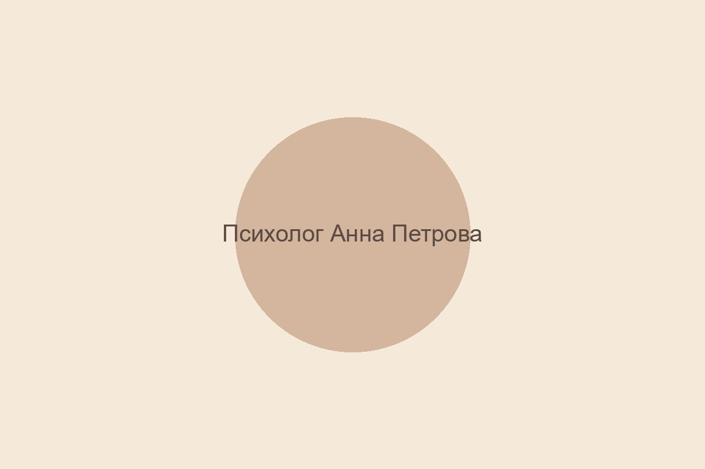
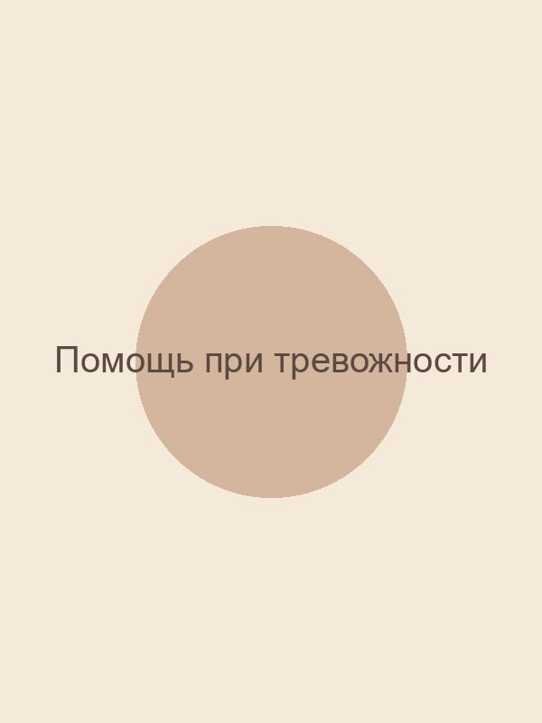

# Техническое проектирование лендинга психолога

## Структура HTML

### Базовый каркас
```html
<!DOCTYPE html>
<html lang="ru">
<head>
    <meta charset="UTF-8">
    <meta name="viewport" content="width=device-width, initial-scale=1.0">
    <title>Психолог [Имя Фамилия] | Помощь при тревожности и консультации онлайн</title>
    <meta name="description" content="Профессиональный психолог с опытом работы 10+ лет. Специализация: тревожность, стресс, эмоциональные трудности. Индивидуальные консультации онлайн и офлайн.">
    <link rel="stylesheet" href="css/variables.css">
    <link rel="stylesheet" href="css/style.css">
    <link rel="stylesheet" href="css/responsive.css">
    <link rel="preconnect" href="https://fonts.googleapis.com">
    <link rel="preconnect" href="https://fonts.gstatic.com" crossorigin>
    <link href="https://fonts.googleapis.com/css2?family=Playfair+Display:wght@400;500;600;700&family=Open+Sans:wght@300;400;500;600&display=swap" rel="stylesheet">
    <link rel="icon" type="image/x-icon" href="assets/favicon.ico">
    <!-- Structured Data -->
    <script type="application/ld+json">
    {
        "@context": "https://schema.org",
        "@type": "LocalBusiness",
        "name": "Психолог [Имя Фамилия]",
        "description": "Профессиональный психолог, специализирующийся на работе с тревожностью",
        "address": {
            "@type": "PostalAddress",
            "addressLocality": "Москва",
            "postalCode": "101000",
            "streetAddress": "ул. Примерная, д. 1"
        },
        "telephone": "+7 (999) 123-45-67",
        "email": "contact@psychologist-landing.com",
        "url": "https://psychologist-landing.com",
        "priceRange": "₽₽",
        "openingHours": "Mo-Fr 09:00-20:00",
        "image": "https://psychologist-landing.com/images/psychologist-photo.jpg"
    }
    </script>
</head>
<body>
    <!-- Skip to main content for accessibility -->
    <a href="#main-content" class="skip-link">Перейти к основному содержанию</a>

    <!-- Header -->
    <header class="header">
        <div class="container">
            <a href="/" class="logo">Психолог [Имя]</a>
            <nav class="nav">
                <ul class="nav-list">
                    <li><a href="#about">Обо мне</a></li>
                    <li><a href="#services">Услуги</a></li>
                    <li><a href="#advantages">Преимущества</a></li>
                    <li><a href="#reviews">Отзывы</a></li>
                    <li><a href="#faq">FAQ</a></li>
                    <li><a href="#contact" class="btn btn-primary">Записаться</a></li>
                </ul>
                <button class="burger-menu" aria-label="Открыть меню" aria-expanded="false">
                    <span></span>
                    <span></span>
                    <span></span>
                </button>
            </nav>
        </div>
    </header>

    <main id="main-content">
        <!-- Hero Section -->
        <section class="hero">
            <div class="container">
                <div class="hero-content">
                    <h1 class="hero-title">Найти покой в себе — возможно</h1>
                    <p class="hero-subtitle">Профессиональная психологическая помощь для тех, кто устал от тревоги и хочет вернуть гармонию в жизнь</p>
                    <a href="#contact-form" class="btn btn-primary btn-large">Записаться на консультацию</a>
                    <p class="hero-note">Первая консультация со скидкой 20%</p>
                </div>
                <div class="hero-image">
                    
                </div>
            </div>
        </section>

        <!-- About Section -->
        <section id="about" class="about">
            <div class="container">
                <h2 class="section-title">Обо мне</h2>
                <div class="about-grid">
                    <div class="about-text">
                        <p>Я — [Имя Фамилия], дипломированный психолог с 10-летним опытом работы. Специализируюсь на помощи людям, страдающим от тревожности, панических атак и эмоционального выгорания.</p>
                        <ul class="qualifications">
                            <li>Магистр психологии МГУ</li>
                            <li>Сертифицированный специалист по КПТ</li>
                            <li>Член Ассоциации когнитивно-поведенческой психотерапии</li>
                            <li>Более 500 часов супервизии</li>
                        </ul>
                    </div>
                    <div class="about-photo">
                        
                    </div>
                </div>
            </div>
        </section>

        <!-- Services Section -->
        <section id="services" class="services">
            <div class="container">
                <h2 class="section-title">Мои услуги</h2>
                <div class="services-grid">
                    <article class="service-card">
                        <div class="service-icon">🕒</div>
                        <h3>Индивидуальная консультация</h3>
                        <p>60 минут личной встречи для разбора вашей ситуации и плана работы</p>
                        <p class="service-price">5 000 ₽</p>
                        <a href="#contact-form" class="btn btn-secondary">Записаться</a>
                    </article>
                    <article class="service-card">
                        <div class="service-icon">💻</div>
                        <h3>Онлайн-сессия</h3>
                        <p>50 минут удобной консультации из дома через видеосвязь</p>
                        <p class="service-price">4 500 ₽</p>
                        <a href="#contact-form" class="btn btn-secondary">Записаться</a>
                    </article>
                    <article class="service-card">
                        <div class="service-icon">📦</div>
                        <h3>Пакет из 5 консультаций</h3>
                        <p>Комплексный подход с отслеживанием динамики и домашними заданиями</p>
                        <p class="service-price">20 000 ₽</p>
                        <a href="#contact-form" class="btn btn-secondary">Записаться</a>
                    </article>
                </div>
            </div>
        </section>

        <!-- Advantages Section -->
        <section id="advantages" class="advantages">
            <div class="container">
                <h2 class="section-title">Почему выбирают меня</h2>
                <div class="advantages-grid">
                    <div class="advantage-item">
                        <div class="advantage-icon">🔒</div>
                        <h3>Конфиденциальность</h3>
                        <p>Все сессии строго конфиденциальны</p>
                    </div>
                    <div class="advantage-item">
                        <div class="advantage-icon">🎯</div>
                        <h3>Индивидуальный подход</h3>
                        <p>Программа строится под ваши уникальные потребности</p>
                    </div>
                    <div class="advantage-item">
                        <div class="advantage-icon">💬</div>
                        <h3>Поддержка между сессиями</h3>
                        <p>Возможность задать вопросы в чате</p>
                    </div>
                    <div class="advantage-item">
                        <div class="advantage-icon">📊</div>
                        <h3>Доказательные методы</h3>
                        <p>Методики с научно доказанной эффективностью</p>
                    </div>
                </div>
            </div>
        </section>

        <!-- Reviews Section -->
        <section id="reviews" class="reviews">
            <div class="container">
                <h2 class="section-title">Отзывы клиентов</h2>
                <div class="reviews-slider">
                    <div class="review-card">
                        <p class="review-text">"После 3 месяцев работы с [Имя] моя тревожность уменьшилась на 80%. Я снова могу спать спокойно."</p>
                        <p class="review-author">Анна, 32 года</p>
                    </div>
                    <div class="review-card">
                        <p class="review-text">"Профессионал высшего класса. Помог разобраться в причинах моего стресса и дал инструменты для самопомощи."</p>
                        <p class="review-author">Михаил, 45 лет</p>
                    </div>
                    <div class="review-card">
                        <p class="review-text">"Онлайн-формат оказался очень удобным. Качество консультаций ничуть не хуже очных встреч."</p>
                        <p class="review-author">Елена, 28 лет</p>
                    </div>
                </div>
            </div>
        </section>

        <!-- FAQ Section -->
        <section id="faq" class="faq">
            <div class="container">
                <h2 class="section-title">Часто задаваемые вопросы</h2>
                <div class="faq-list">
                    <details class="faq-item">
                        <summary class="faq-question">Сколько длится курс терапии?</summary>
                        <p class="faq-answer">В среднем 8-12 сессий, но всё зависит от индивидуальных целей и сложности запроса.</p>
                    </details>
                    <details class="faq-item">
                        <summary class="faq-question">Можно ли получить помощь срочно?</summary>
                        <p class="faq-answer">Да, я предлагаю срочные консультации в течение 24 часов при наличии свободного окна.</p>
                    </details>
                    <details class="faq-item">
                        <summary class="faq-question">Конфиденциально ли общение?</summary>
                        <p class="faq-answer">Абсолютно. Все сессии защищены профессиональной тайной, данные не передаются третьим лицам.</p>
                    </details>
                    <details class="faq-item">
                        <summary class="faq-question">Работаете ли вы с парами?</summary>
                        <p class="faq-answer">Да, провожу консультации для пар по предварительной записи.</p>
                    </details>
                </div>
            </div>
        </section>

        <!-- Contact Form -->
        <section id="contact-form" class="contact-form">
            <div class="container">
                <h2 class="section-title">Записаться на консультацию</h2>
                <p class="section-subtitle">Оставьте свои данные, и я свяжусь с вами в течение 24 часов</p>
                <form id="consultation-form" class="form" novalidate>
                    <div class="form-group">
                        <label for="name">Имя *</label>
                        <input type="text" id="name" name="name" required aria-required="true">
                        <div class="error-message" id="name-error"></div>
                    </div>
                    <div class="form-group">
                        <label for="phone">Телефон *</label>
                        <input type="tel" id="phone" name="phone" required aria-required="true">
                        <div class="error-message" id="phone-error"></div>
                    </div>
                    <div class="form-group">
                        <label for="email">Email</label>
                        <input type="email" id="email" name="email">
                        <div class="error-message" id="email-error"></div>
                    </div>
                    <div class="form-group">
                        <label for="preferred-contact">Предпочтительный способ связи</label>
                        <select id="preferred-contact" name="preferred-contact">
                            <option value="phone">Телефон</option>
                            <option value="email">Email</option>
                            <option value="whatsapp">WhatsApp</option>
                        </select>
                    </div>
                    <div class="form-group">
                        <label for="message">Краткое описание проблемы (необязательно)</label>
                        <textarea id="message" name="message" rows="3"></textarea>
                    </div>
                    <div class="form-group checkbox">
                        <input type="checkbox" id="privacy" name="privacy" required aria-required="true">
                        <label for="privacy">Я соглашаюсь с <a href="/privacy">политикой конфиденциальности</a> *</label>
                        <div class="error-message" id="privacy-error"></div>
                    </div>
                    <button type="submit" class="btn btn-primary btn-submit">Отправить заявку</button>
                </form>
            </div>
        </section>
    </main>

    <!-- Footer -->
    <footer class="footer">
        <div class="container">
            <div class="footer-grid">
                <div class="footer-col">
                    <h3 class="footer-title">Психолог [Имя Фамилия]</h3>
                    <p>Профессиональная психологическая помощь при тревожности, стрессе и эмоциональных трудностях.</p>
                </div>
                <div class="footer-col">
                    <h4 class="footer-subtitle">Контакты</h4>
                    <ul class="footer-contacts">
                        <li>📞 +7 (999) 123-45-67</li>
                        <li>✉️ contact@psychologist-landing.com</li>
                        <li>📍 Москва, ул. Примерная, д. 1</li>
                    </ul>
                </div>
                <div class="footer-col">
                    <h4 class="footer-subtitle">Часы работы</h4>
                    <ul class="footer-hours">
                        <li>Пн-Пт: 9:00-20:00</li>
                        <li>Сб: 10:00-16:00</li>
                        <li>Вс: выходной</li>
                    </ul>
                </div>
                <div class="footer-col">
                    <h4 class="footer-subtitle">Социальные сети</h4>
                    <ul class="footer-social">
                        <li><a href="#" aria-label="Instagram">Instagram</a></li>
                        <li><a href="#" aria-label="Telegram">Telegram</a></li>
                        <li><a href="#" aria-label="VK">VK</a></li>
                    </ul>
                </div>
            </div>
            <div class="footer-bottom">
                <p>&copy; 2025 Психолог [Имя Фамилия]. Все права защищены.</p>
                <p><a href="/privacy">Политика конфиденциальности</a> | <a href="/terms">Условия использования</a></p>
            </div>
        </div>
    </footer>

    <!-- Scripts -->
    <script src="js/main.js"></script>
    <script src="js/validation.js"></script>
    <script src="js/animations.js"></script>
</body>
</html>
```

## CSS Архитектура

### Структура CSS файлов
1. **variables.css** – CSS-переменные (цвета, шрифты, отступы)
2. **reset.css** – сброс стилей по умолчанию
3. **base.css** – базовые стили (body, типографика)
4. **components.css** – компоненты (кнопки, карточки, формы)
5. **layout.css** – сетка и расположение блоков
6. **sections.css** – стили для конкретных секций
7. **responsive.css** – медиа-запросы
8. **utilities.css** – вспомогательные классы

### Пример variables.css
```css
:root {
    /* Colors */
    --color-primary: #F5E9D9;
    --color-secondary: #E8D5C4;
    --color-accent: #D4B59E;
    --color-dark: #5A4A42;
    --color-light: #FFFBF7;
    --color-success: #A3C9A8;
    --color-error: #E8B4B8;

    /* Typography */
    --font-heading: 'Playfair Display', serif;
    --font-body: 'Open Sans', sans-serif;
    --font-size-xs: 0.75rem;
    --font-size-sm: 0.875rem;
    --font-size-base: 1rem;
    --font-size-lg: 1.125rem;
    --font-size-xl: 1.25rem;
    --font-size-2xl: 1.5rem;
    --font-size-3xl: 2rem;
    --font-size-4xl: 2.5rem;
    --font-size-5xl: 3rem;

    /* Spacing */
    --spacing-xs: 0.25rem;
    --spacing-sm: 0.5rem;
    --spacing-md: 1rem;
    --spacing-lg: 1.5rem;
    --spacing-xl: 2rem;
    --spacing-2xl: 3rem;
    --spacing-3xl: 4rem;

    /* Border radius */
    --radius-sm: 4px;
    --radius-md: 8px;
    --radius-lg: 16px;
    --radius-xl: 24px;
    --radius-full: 50px;

    /* Shadows */
    --shadow-sm: 0 2px 4px rgba(0, 0, 0, 0.05);
    --shadow-md: 0 4px 8px rgba(0, 0, 0, 0.1);
    --shadow-lg: 0 8px 16px rgba(0, 0, 0, 0.1);

    /* Transitions */
    --transition-fast: 0.2s ease;
    --transition-normal: 0.3s ease;
    --transition-slow: 0.5s ease;
}
```

### Mobile-first подход
- Все стили пишутся для мобильных устройств
- Медиа-запросы `min-width` для планшетов и десктопов
- Использование `clamp()` для адаптивной типографики

## JavaScript функциональность

### Основные модули
1. **main.js** – инициализация, управление меню, плавная прокрутка
2. **validation.js** – валидация формы с кастомными сообщениями
3. **animations.js** – анимации появления элементов при скролле

### Бургер-меню
```javascript
class MobileMenu {
    constructor() {
        this.burger = document.querySelector('.burger-menu');
        this.nav = document.querySelector('.nav-list');
        this.body = document.body;
        
        this.burger.addEventListener('click', () => this.toggle());
        
        // Закрытие при клике на ссылку
        document.querySelectorAll('.nav-list a').forEach(link => {
            link.addEventListener('click', () => this.close());
        });
    }
    
    toggle() {
        this.burger.classList.toggle('active');
        this.nav.classList.toggle('active');
        this.body.classList.toggle('menu-open');
        this.burger.setAttribute('aria-expanded', 
            this.burger.classList.contains('active'));
    }
    
    close() {
        this.burger.classList.remove('active');
        this.nav.classList.remove('active');
        this.body.classList.remove('menu-open');
        this.burger.setAttribute('aria-expanded', 'false');
    }
}
```

### Валидация формы
```javascript
class FormValidator {
    constructor(formId) {
        this.form = document.getElementById(formId);
        this.fields = {
            name: { required: true, pattern: /^[А-Яа-яЁё\s-]{2,50}$/ },
            phone: { required: true, pattern: /^[\d\s\-\+\(\)]{10,20}$/ },
            email: { required: false, pattern: /^[^\s@]+@[^\s@]+\.[^\s@]+$/ }
        };
        
        this.form.addEventListener('submit', (e) => this.validateForm(e));
        this.setupLiveValidation();
    }
    
    validateField(fieldName, value) {
        const rules = this.fields[fieldName];
        if (!rules) return true;
        
        if (rules.required && !value.trim()) {
            return 'Это поле обязательно для заполнения';
        }
        
        if (value && rules.pattern && !rules.pattern.test(value)) {
            return 'Пожалуйста, введите корректные данные';
        }
        
        return '';
    }
    
    validateForm(e) {
        e.preventDefault();
        let isValid = true;
        
        Object.keys(this.fields).forEach(fieldName => {
            const input = this.form.querySelector(`[name="${fieldName}"]`);
            if (input) {
                const error = this.validateField(fieldName, input.value);
                this.showError(input, error);
                if (error) isValid = false;
            }
        });
        
        if (isValid) {
            this.submitForm();
        }
    }
    
    showError(input, message) {
        const errorElement = input.nextElementSibling;
        if (errorElement && errorElement.classList.contains('error-message')) {
            errorElement.textContent = message;
            input.setAttribute('aria-invalid', !!message);
        }
    }
    
    submitForm() {
        // Отправка данных на сервер
        const formData = new FormData(this.form);
        fetch('/api/consultation', {
            method: 'POST',
            body: formData
        })
        .then(response => {
            if (response.ok) {
                this.showSuccess();
            } else {
                throw new Error('Ошибка отправки');
            }
        })
        .catch(error => {
            this.showError('Произошла ошибка. Пожалуйста, попробуйте позже.');
        });
    }
}
```

### Анимации при скролле
```javascript
class ScrollAnimations {
    constructor() {
        this.observerOptions = {
            root: null,
            rootMargin: '0px',
            threshold: 0.1
        };
        
        this.observer = new IntersectionObserver(
            (entries) => this.handleIntersection(entries),
            this.observerOptions
        );
        
        this.init();
    }
    
    init() {
        document.querySelectorAll('.animate-on-scroll').forEach(el => {
            this.observer.observe(el);
        });
    }
    
    handleIntersection(entries) {
        entries.forEach(entry => {
            if (entry.isIntersecting) {
                entry.target.classList.add('animated');
                this.observer.unobserve(entry.target);
            }
        });
    }
}
```

## SEO оптимизация

### Мета-теги (уже в HTML)
- Title с ключевыми словами (до 60 символов)
- Description с призывом (до 160 символов)
- Open Graph для социальных сетей
- Twitter Card

### Структурированные данные
- LocalBusiness
- ProfessionalService
- Review (для отзывов)
- FAQPage (для вопросов)

### Sitemap.xml
```xml
<?xml version="1.0" encoding="UTF-8"?>
<urlset xmlns="http://www.sitemaps.org/schemas/sitemap/0.9">
    <url>
        <loc>https://psychologist-landing.com/</loc>
        <lastmod>2025-01-15</lastmod>
        <changefreq>monthly</changefreq>
        <priority>1.0</priority>
    </url>
</urlset>
```

### Robots.txt
```
User-agent: *
Allow: /
Disallow: /admin/
Disallow: /private/

Sitemap: https://psychologist-landing.com/sitemap.xml
```

### Оптимизация производительности
1. **Изображения**: WebP с fallback, lazy loading, правильные размеры
2. **CSS/JS**: минификация, объединение, асинхронная загрузка
3. **Шрифты**: предзагрузка, subset, display: swap
4. **Кэширование**: заголовки Cache-Control
5. **Сжатие**: Gzip/Brotli

### Доступность (Accessibility)
- Семантические теги (header, main, section, article, nav)
- ARIA-атрибуты (aria-label, aria-expanded, aria-invalid)
- Контраст цветов не менее 4.5:1
- Клавиатурная навигация (tabindex, focus styles)
- Skip links для пропуска навигации

## Рекомендации по развертыванию

### Хостинг
- Статический хостинг (Netlify, Vercel, GitHub Pages)
- CDN для статических ресурсов
- SSL сертификат (обязательно)

### Доменное имя
- Короткое, запоминающееся
- Включает ключевое слово (например, psychologist.ru)
- Регистрация на 2+ года для доверия поисковиков

### Аналитика
- Google Analytics 4
- Яндекс.Метрика
- Heatmaps (Hotjar, Crazy Egg)

### Дополнительные страницы
1. **Политика конфиденциальности** (обязательно для формы)
2. **Условия использования**
3. **Блог** (для SEO и привлечения трафика)

## Тестирование

### Кроссбраузерность
- Chrome, Firefox, Safari, Edge
- Mobile Safari, Chrome for Android
- Проверка на реальных устройствах

### Производительность
- Lighthouse audit (цель: 90+)
- PageSpeed Insights
- WebPageTest

### Доступность
- axe DevTools
- WAVE Evaluation Tool
- Ручная проверка с screen reader